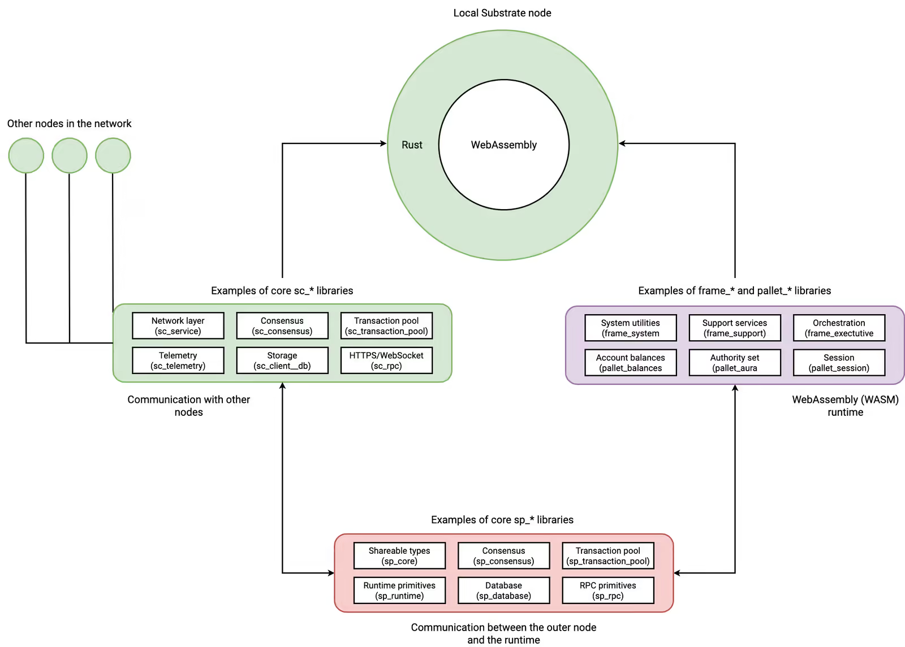
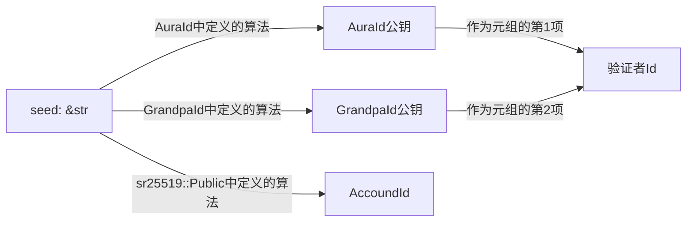

# Substrate Node Template学习笔记

## 可能有用的资源链接

- [CLI Tools中对Substrate Node Template的描述](https://docs.substrate.io/reference/command-line-tools/node-template/)
- [Explore the code](https://docs.substrate.io/quick-start/explore-the-code/)
- [Substrate术语解释表](https://docs.substrate.io/reference/glossary)
- [掘金 - Substrate专栏](https://juejin.cn/column/7227098017555005500)

## 阅读`cargo metadata`的输出

该指令的输出格式为JSON格式，整体还是较为清晰的。只不过其中的`resolve`字段，比较不好理解，现结合Cargo手册进行说明。

`resolve`字段下设`nodes`和`root`两个字段。后者是根crate，但不一定有值，可能是`null`；前者是一个数组，标识依赖图（Dependency Graph）中的节点，其中包含许多形似如下的代码片段：

```json
{
    // 这id确实能唯一标识一个依赖项
    "id": "registry+https://github.com/rust-lang/crates.io-index#aead@0.4.3",
    // 当前节点所有依赖项的id
    "dependencies": [
        "registry+https://github.com/rust-lang/crates.io-index#generic-array@0.14.7",
        "registry+https://github.com/rust-lang/crates.io-index#rand_core@0.6.4"
    ],
    // 当前节点依赖项的具体信息，和上边的"dependencies"的内容一一对应
    "deps": [
        {
            // 考虑到Cargo.toml中可以给crate改别名，
            // 因此这儿的name有可能是别名
            "name": "generic_array",
            // 依赖项的id
            "pkg": "registry+https://github.com/rust-lang/crates.io-index#generic-array@0.14.7",
            "dep_kinds": [
                {
                    // 依赖项的类型，可以是
                    // "normal"（表现为null）、"build"、"dev"等
                    "kind": null,
                    // 依赖项的目标平台，可以是
                    // null（表现为null）、"cfg(windows)"等
                    "target": null
                }
            ]
        },
        {
            "name": "rand_core",
            "pkg": "registry+https://github.com/rust-lang/crates.io-index#rand_core@0.6.4",
            // 其余内容和上一项类似
            // -- snip --
        }
    ],
    // 当前节点已经启用的feature列表
    "features": [
        "alloc",
        "rand_core",
        "std"
    ]
}
```

## Substrate Node Template及其大致划分

[Explore the code](https://docs.substrate.io/quick-start/explore-the-code/)章节对Substrate Node Template（下简称SNT）的代码结构作了概要性陈述，翻译如下：

> **关于SNT**
>
> SNT囊括了一些默认的区块链要素构件，例如p2p网络、简易共识机制、交易处理等。针对账号、余额、交易手续费、管理员权限等功能，SNT也提供了一些基础的功能支持。
>
> 这些核心功能的实现，是通过预先定义好的**pallets**模块来实现的，例如以下几个模块：
> - `pallet_balances`：管理账户资产和账户之间的转账。
> - `pallet_transaction_payment`：管理交易手续费的处理。
> - `pallet_sudo`：执行需要管理员权限的操作。
>
> SNT也提供了一个模板pallet——`pallet_template`，用以展示如何实现自定义pallet的功能。
>
> 有了上述的了解后，我们可以更加深入地探索SNT的代码，看看`substrate-node-template`里都有些啥。
>
> **清单文件**
>
> Substrate基于Rust编写，因此每个Rust项目都会有自己独立的`Cargo.toml`文件，指导该项目的编译过程。在`substrate-node-template`目录下的`Cargo.toml`，记录着构成SNT 工作空间（workspace）的几个成员（member）项目，像这样：
>
> ```toml
> [workspace]
> members = [
>     "node",
>     "pallets/template",
>     "runtime",
> ]
> [profile.release]
> panic = "unwind"
> ```
>
> 这么看来，SNT是由三个成员组成的：
> - `node`：提供Rust模块实现了很多核心区块链服务，例如p2p网络、区块产生、区块确认（finalization）、交易池管理等。
> - `pallets/template`：提供了模板pallet——`pallet_template`，用以展示如何实现自定义pallet的功能。
> - `runtime`：提供区块链应用逻辑，包括账号、余额、交易手续费等功能的实现。
>
> 每个成员项目也有各自的`Cargo.toml`清单文件，内含编译各成员所需的依赖项、设定等信息。举例来说，`node`项目的`Cargo.toml`文件指定了该成员的名字叫"node-template"，并且列出了一些核心库和原语，以提供区块链节点模板提供基本区块链服务所需的基本功能。关于库和原语，在[架构与rust库](https://docs.substrate.io/learn/architecture/)中有更详细的描述。
>
> 当下，只需明白清单文件记录着很多重要信息，就足够了。
>
> 如果去看`runtime/Cargo.toml`和`pallets/template/Cargo.toml`的话，会发现他们依赖的库和原语不尽相同，但是对各自依赖些啥会有点了解。
>
> **核心客户端源码**
>
> Substrate区块链的一大特点就是，节点由两个部分组成：核心客户端和运行时。SNT也不例外，其提供核心客户端服务的rust项目位于`node/src`目录，而运行时实现位于`runtime/src`目录。
>
> 默认情况下，`node/src`目录包含以下Rust模块：
>
> - `benchmarking.rs`
> - `chain_spec.rs`
> - `cli.rs`
> - `command.rs`
> - `lib.rs`
> - `main.rs`
> - `rpc.rs`
> - `service.rs`
>
> 大部分核心客户端服务逻辑都位于`service.rs`模块中。这些代码在开发时几乎不需要更改。
>
> 在开发时最有可能需要修改的是`chain_spec.rs`文件，它描述了默认开发和本地测试网络的配置，包括默认预充值的开发用账户，和预置的有生产区块权限的节点。如果开发者想创建一个自定义的链，那么就需要修改`chain_spec.rs`文件，以指定该链所连接到的网络，以及与之通信的其他节点。
>
> **SNT默认运行时**
>
> 鉴于Substrate的模块性和灵活性，你可以任意修改工作空间中的任意一个Rust项。但是，大部分应用开发工作都在运行时和pallet中进行。在开始自定义运行时之前，你应该花点时间探索一下SNT默认的运行时。
>
> 默认运行时的清单文件`Cargo.toml`中记录了许多名字类似于`pallet-balances`, `pallet-sudo`这样的依赖项。除此之外，也有些名字类似`frame-xxx`的核心依赖项，例如`frame-system`, `frame-support`, `frame-executive`等。关于这些[核心依赖项](https://docs.substrate.io/learn/runtime-development/#core-frame-services)，目前只需知道它们是必要的就行了，不用太过在意。
>
> 默认运行时的源代码放在`runtime/src/lib.rs`文件中。打开一看好复杂，其实本质就这样：
>
> - import了`frame_system`和`frame_support`核心依赖项。
> - 指定了运行时的版本信息。
> - 声明了要包含的pallet。
> - 声明了每个pallet的类型和参数。
> - 设置了每个pallet的常量和变量值。
> - 为每个pallet实现了`Config` trait。
> - 用这些pallet构造出了运行时。
> - 为评估pallet性能而准备了benchmarking框架。
> - 实现了供核心客户端调用运行时的接口。
>
> 在[构造](https://docs.substrate.io/build/)和[测试](https://docs.substrate.io/test/)中有更多关于运行时的构建、定义基准测试、使用运行时的接口等话题的知识。现在对这些内容有个大概了解就成。

由于SNT的依赖项非常多且功能复杂，开发团队使用了一种特殊的命名方法来区别不同依赖项的作用，如下图所述：



可以看到上图中依照依赖项的用途，将依赖项的前缀划分为三种：

- 节点外服务：负责和其他节点进行通信
  - `sc_*`
- WASM运行时
  - `frame_*`
  - `pallet_*`
- 负责节点外服务（outer node）和运行时的数据通信
  - `sp_*`

## 对SNT的初步理解

关于SNT的结构划分，可以参考一下[旧版仓库](https://github.com/Endericedragon/substrate-node-template-copy?tab=readme-ov-file#template-structure)里的描述。简单翻译一下：

> 像这样的Substrate项目通常都包含许多组件，它们分布在各个不同的目录中。
>
> **Node组件**
>
> 一个区块链节点，就是一个允许用户参与到一个区块链网络中的应用程序。基于Substrate开发的区块链节点，提供了许多功能：
>
> - 网络：Substrate节点使用[libp2p](https://libp2p.io)网络协议栈（译者注：这个协议栈有官方认可的[rust实现](https://github.com/libp2p/rust-libp2p)），实现了区块链网络中节点之间的通信。
> - 共识：[共识算法](https://docs.substrate.io/learn/consensus/)是区块链必须的，这样才能确定网络的状态。Substrate允许开发者提供自定义的共识引擎，同时也内置了多个基于Web3基金会研究的共识机制。
> - RPC服务器：用于与Substrate节点进行交互的远程过程调用（RPC）服务器。
>
> `node`目录中有许多文件，其中有几个值得特别留意：
>
> - `chain_spec.rs`：规定了Substrate链的初始状态（创世状态genesis state）。这玩意在开发和测试的时候很好使，而且在生产环境中也很重要。其中的`development_config`和`testnet_genesis`函数特别重要，它们定义了本地开发链的创世状态。这些函数定义了一些知名账户（例如Alice和Bob），并将它们用于配置区块链的初始状态。
> - `service.rs`：定义了Substrate节点的实现。其中的库引用和函数调用都值得关注。涉及共识相关的部分尤其值得关注，例如区块最终封装确定（finalization）和分叉等，还有其他共识机制，例如Aura用于区块产生，GRANDPA用于区块封装确定。
>
> **Runtime组件**
>
> 在Substrate的语境中，运行时（runtime）和状态转移函数（state transition function）非常类似。两者都指代区块链的核心逻辑，负责验证区块和执行状态变更。Substrate项目在本仓库中使用[FRAME](https://docs.substrate.io/learn/runtime-development/#frame)构建了区块链运行时。FRAME允许运行时开发者声明特定领域的逻辑，称为“pallet”，并将其统统组合成一个运行时，以满足各种需求。
>
> 在阅读`src/runtime/lib.rs`时，注意以下事项：
> - 该源代码文件为运行时加入了好几个pallet。每个pallet的配置都定义在一个`impl $PALLET名字::Config for Runtime`代码块中。
> - 这些pallet通过`construct_runtime!`宏组合在一起，形成了一个大的运行时。它是FRAME的核心库的一部分。
>
> **Pallets组件**
>
> 该Substrate项目的运行时除了由一大堆随同Substrate代码仓库一同发布的FRAME pallet组成，还另有一个模板pallet，位于`pallets`目录中。
>
> FRAME pallet由一大堆区块链基本构件（primitives）组成，这其中包括：
> - 存储：FRAME定义了一系列强大的存储抽象，使得Substrate的高效的键值数据库可以轻松地管理区块链的演进状态。
> - 分派函数：FRAME pallet定义了一些特殊类型的函数，可以从运行时之外的外部环境调用（dispatch）来更新其状态。
> - 事件：Substrate使用事件来通知用户发生了重大状态变化。
> - 错误：当分派函数失败时，它会返回一个错误。
>
> 每个pallet都有一个自己的`Config` trait，它作为通用接口，可以通用地定义它所需的数据类型和参数。

这样一来就指出了一条研究方向：Substrate依赖的libp2p网络协议栈，以及FRAME运行时和pallet的架构。如果能把libp2p给整到rCore上，那就能为实现真正的区块链操作系统打下很好的基础了。

## 初探Node组件

其实`node`目录底下的东西不是很复杂，才8个文件，一路看过去也应该有个了解了。从上文中我们得知这个Node组件主要干三件事：网络、共识、RPC。那么我们可以据此进行模块划分，把Node组件拆成更小的三个子模块。对`node`目录执行`cargo metadata`看看？

结果发现和对SNT根目录执行`cargo metadata`没啥差别。但是好歹`resolve`的`root`有东西了，是`path+file:///home/endericedragon/repos/substrate-node-template-copy/node#node-template@4.0.0-dev`。

在`packages`字段中搜索`node-template`，找到了`node`包，我们来看看关于它的基本信息：

```json
{
    "name": "node-template",
    "version": "4.0.0-dev",
    "id": "path+file:///home/endericedragon/repos/substrate-node-template-copy/node#node-template@4.0.0-dev",
    "license": "MIT-0",
    "license_file": null,
    "description": "A fresh FRAME-based Substrate node, ready for hacking.",
    "source": null,
    "dependencies": [...],
    "targets": [
        {
            "kind": [
                "lib"
            ],
            "crate_types": [
                "lib"
            ],
            "name": "node-template",
            "src_path": "/home/endericedragon/repos/substrate-node-template-copy/node/src/lib.rs",
            "edition": "2021",
            "doc": true,
            "doctest": true,
            "test": true
        },
        {
            "kind": [
                "bin"
            ],
            "crate_types": [
                "bin"
            ],
            "name": "node-template",
            "src_path": "/home/endericedragon/repos/substrate-node-template-copy/node/src/main.rs",
            "edition": "2021",
            "doc": true,
            "doctest": false,
            "test": true
        },
        {
            "kind": [
                "custom-build"
            ],
            "crate_types": [
                "bin"
            ],
            "name": "build-script-build",
            "src_path": "/home/endericedragon/repos/substrate-node-template-copy/node/build.rs",
            "edition": "2021",
            "doc": false,
            "doctest": false,
            "test": false
        }
    ],
    // -- snip --
}
```

按照我们从输出倒推输入的一贯作风，我们先看看把SNT运行起来会看到啥。

第一个输出标记了笔者之前发现的程序入口点（现已删除）：

```rust
I guess the whole program starts from here!
```


这个`println!`位于`node/src/main.rs`中。跟踪其运行轨迹，可知其下一步会前往这个函数：

```rs
// file: node/src/command.rs

pub fn run() -> sc_cli::Result<()> {
	// 解析命令行参数，形成结构化的配置选项
	let cli = Cli::from_args();

	match &cli.subcommand {
        // --snip --
		None => {
			// ./target/release/node-template --dev 将会来到这个分支
			let runner = cli.create_runner(&cli.run)?;
			runner.run_node_until_exit(|config| async move {
				service::new_full(config).map_err(sc_cli::Error::Service)
			})
		},
	}
}
```

之所以把match的其他arm都删掉，是因为根据调试结果，`./target/release/node-template --dev`直接就捅到最后一个分支去了，其他分支直接忽视即可。其中的`run_node_until_exit`值得关注，这意味着SNT进入了一个永不停止的事件循环（实际上也确实如此，因为只有按Ctrl+C才能让SNT停下来）。

进入这个函数之后首先会打印一大堆信息：

```bash
2024-06-28 21:00:30 Substrate Node
2024-06-28 21:00:30 ✌️  version 4.0.0-dev-65686f28d2e
2024-06-28 21:00:30 ❤️  by Substrate DevHub <https://github.com/substrate-developer-hub>, 2017-2024
2024-06-28 21:00:30 📋 Chain specification: Development
2024-06-28 21:00:30 🏷  Node name: exuberant-breath-4025
2024-06-28 21:00:30 👤 Role: AUTHORITY
```

> 这里有个值得关注的点，即：很多方法在调试时不会立马返回，而是会愣一会（阻塞一段时间）再返回，这是因为这些耗时的任务都是使用tokio的Runtime的`block_on`方法执行的，虽然是协程执行但是却用阻塞的办法执行，因此需要等一会。

第一次阻塞发生在这里：

```rust
// file: ~/.cargo/git/checkouts/substrate-7e08433d4c370a21/948fbd2/client/cli/src/runner.rs
let mut task_manager = self.tokio_runtime.block_on(initialize(self.config))?;
```

这段程序会在控制台输出：

```bash
2024-06-30 16:04:19 💾 Database: RocksDb at /tmp/substrate1JC7cz/chains/dev/db/full
2024-06-30 16:04:47 🔨 Initializing Genesis block/state (state: 0xf5e5…55e2, header-hash: 0x8116…d409)
2024-06-30 16:04:47 👴 Loading GRANDPA authority set from genesis on what appears to be first startup.
2024-06-30 16:04:48 Using default protocol ID "sup" because none is configured in the chain specs
2024-06-30 16:04:48 🏷  Local node identity is: 12D3KooWL4N3swArnvrkRQXNTnv8JzsvMKnUX1h8jkdUPoUU21ey
```

其中出现的`initialize`是`run_node_until_exit`函数的唯一一个传入的参数，其类型为`impl FnOnce(Configuration) -> F`。换言之，上述语句令在tokio的runtime中执行了initialize闭包，后者返回了一个什么东西，存储于`task_manager`中。回看调用`run_node_until_exit`的地方，发现SNT传入了一个这样的闭包：

```rs
|config| async move {
    service::new_full(config).map_err(sc_cli::Error::Service)
}
```

看来有必要调查一下`service`模块了。

接下来的事情就有趣了，程序运行到这里，就开始玩命生产 & 封装区块了：

```rs
let res = self
    .tokio_runtime
    .block_on(self.signals.run_until_signal(task_manager.future().fuse()));
```

这说明挖矿的逻辑就在这个`self.signals.run_until_signal(task_manager.future().fuse())`里。因此，这里出现的每一个函数都值得好好研究一番。

### chain_spec 模块

Substrate文档中特意提及，node目录中有几个文件需要重点关注，一个是`chain_spec.rs`，另一个是`service.rs`。本节将讨论前者，下一节讨论后者。

**引用分析**

首先从`runtime`中引用了一大堆表征账户、配置的struct。然后从`sc_service`中引入了表征链类型的枚举`ChainType`：

```rs
pub enum ChainType {
    Development,
    Local,
    Live,
    Custom( /* … */ )
}
```

从上文中的叙述可知，以`sc_*`开头的依赖负责和外部其他节点通信。这是`chain_spec.rs`唯一一个用到`sc_*`的地方。其余的依赖项都是从`sp_*`引入的，即负责节点通信模块和内部runtime模块数据交换的依赖项。

**私有辅助函数**

只有一个私有的辅助函数：

```rust
fn testnet_genesis(
	wasm_binary: &[u8], // 来源于WASM_BINARY.ok_or_else(...)
	initial_authorities: Vec<(AuraId, GrandpaId)>, // 一个列表，其中包含PoA共识算法所需要的区块生产者（authority）的Id对，由同一个种子在AuraId和GrandpaId中计算获得的两个公钥构成。
	root_key: AccountId, // 根用户，管理员，通常是通过调用get_account_id_from_seed从给定seed中算出来的
	endowed_accounts: Vec<AccountId>, // 所有预定用户的列表
	_enable_println: bool,
) -> RuntimeGenesisConfig
```

其中，`WASM_BINARY`是从`runtime`中引入的常量，`AuraId, GrandpaId, AccountId, RuntimeGenesisConfig`均为从`runtime`中引入的结构体，他们的作用将会在后续的公开函数中解释。不过，联系上下文来看，可以给出这样的转换关系：



上述函数构造一个创世块的配置文件，其中预置账号为`endowed_accounts`所指定，区块生产者由`initial_authorities`指定，超级管理员由`root_key`指定。

> 注：在Substrate语境下，共识操作分为两步，一步叫Block Authoring（节点用来生产区块的方法），一步叫Block Finalization（在链出现分支时确定选择哪个分支的方法）。因此可以推断，上文代码中的`initial_authorities`实际上指的就是生产区块的账户。

**公开函数**

```rs
pub fn get_from_seed<TPublic: Public>(seed: &str) -> <TPublic::Pair as Pair>::Public
```

上述函数可以接受一个字符串（字面量）作为种子，然后按照泛型参数`TPublic`中定义的求密钥对（一公一私）算法求得公钥。

```rs
pub fn get_account_id_from_seed<TPublic: Public>(seed: &str) -> AccountId
where
	AccountPublic: From<<TPublic::Pair as Pair>::Public>,
```

上述函数经历了数次转换。首先，接受一个字符串（字面量）作为种子，然后按照泛型参数`TPublic`中定义的算法求得公钥。取得公钥后，转换为`AccountPublic`，再调用`into_account`方法，最终获得了`AccountId`。

```rs
pub fn authority_keys_from_seed(s: &str) -> (AuraId, GrandpaId) {
	(get_from_seed::<AuraId>(s), get_from_seed::<GrandpaId>(s))
}
```

上述函数结构过于简单，直接把源代码丢这儿，实际上就是用Aura和GRANDPA两种算法把同一个种子各自算一遍，然后塞进一个元组里形成一对唯一标识一位区块生产者的“键”。

```rs
pub fn development_config() -> Result<ChainSpec, String>
pub fn local_testnet_config() -> Result<ChainSpec, String>
```

这俩太像了，放在一起讲也成。他们的任务都是类似的：

1. 根据`WASM_BINARY`找到WASM二进制文件的位置。找不到就报错，退出。
2. 以`ChainSpec`的形式，返回一个链配置。
   1. 前者的链名为`Development`，id为`dev`；后者的链名为`Local Testnet`，id为`local_testnet`。
   2. 前者的链类型为`ChainType::Development`，后者的是`ChainType::Local`。
   3. 前者的区块生产者只有"Alice"，后者有"Alice"和"Bob"。
   4. 前者的预置账号只有四个，后者有一大堆。

其余选项均为空，故不再赘述。这俩函数会在`node/src/command.rs`的`impl SubstrateCli for Cli`中的`load_spec`方法中被调用。但是后者似乎没在任何地方被调用过？？？可能这个调用不是显式的，而且其调用位置可能压根不在SNT中而是在SNT的依赖中（毕竟是个trait）。

### service 模块

这模块使用了两种共识算法。为了更好地分析代码，有必要了解一下这两种共识算法。

> **Aura共识算法：生产区块**
>
> [Aura共识算法](https://openethereum.github.io/Aura)十分容易理解。它是用来确定由谁来生产区块的。这东西的工作流程大致如下：
>
> 1. 将连续的时间划分为离散的一个一个时间片。每个时间片中，只有一部分的区块生产者能产生新的区块。
> 2. 在一个时间片中选择生产者的办法是轮换：$选中的生产者的编号 = \frac{当前时间戳}{时间片大小}\ \%\ 生产者数量$。
> 3. 另有一种叫BABE的共识算法，它和Aura一样也负责区块生成，但它选择生产者的办法是使用随机数随机选择。

> **Grandpa共识算法：消除分叉**
>
> GRANDPA共识算法似乎有些复杂，以至于需要一整篇论文来论述它。好在[波卡链wiki](https://wiki.polkadot.network/docs/learn-consensus#finality-gadget-grandpa)简要介绍了一下这个东西，大概是这么个运作方法：
>
> 1. 首先指定一组节点用来做“选民”（voter），他们会给一段链（而不是单个的节点，这样干有利于提高效率）投票。
> 2. 一旦某条分叉获得了$\frac{2}{3}$的票数，就把它认为是“正统的”，然后把其他分叉都丢掉。
> 3. 似乎不止一轮投票，起码得经过两轮（预投票pre-vote和预提交pre-commit）。
>
> 在Substrate中它以[frame pallet的形式](https://github.com/paritytech/polkadot-sdk/tree/master/substrate/frame/grandpa)出现。

有了以上的知识储备，让我们dive into service.rs吧。

`service.rs`中直接被外界调用的就是它的`new_full`函数，该函数在正常状态下返回一个`Result<TaskManager, ...>`，因此首先需要知道这个`TaskManager`何方神圣。通过F12大法知道。。。还是看不懂。